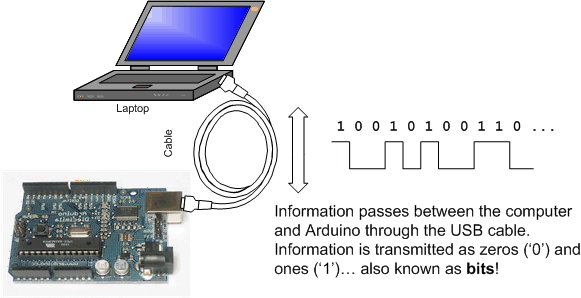
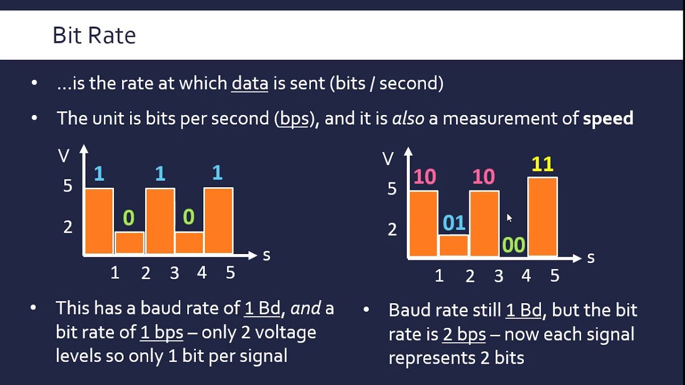
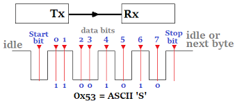

# Module 1 - Serial Communication Between Arduino and Another Computer

A robot typically requires data transfer between its computer systems. In our case, the system will consist of an Arduino microcontroller and one other computer. The Arduino and computer are physically connected by a universal serial bus (USB) cable. Data may be serially transferred through the cable, allowing a robot's computer system to exchange sensor state information and control commands with the Arduino.




[Image 1][[1]: https://www.ladyada.net/images/arduino/serialdata.gif


## Serial Communication

Serial communication is the process of sending data one bit at a time, sequentially, over a communication channel or computer bus.


[Image 2][2]: https://cdn.sparkfun.com/r/700-700/assets/e/5/4/2/a/50e1ccf1ce395f962b000000.png


Serial communication between the Arduino and computer is asynchronous, meaning the devices are not connected by a common clock. It is critical that both devices are configured exactly the same in terms of
- Baud Rate
- Data bits
- Synchronization bits
- Parity bits


### Baud Rate and Bit Rate

The bit rate is the number of transmitted bits per second. Baud rate is defined as the number of signal or symbol changes per second. Baud rate differs from bit rate when more than one bit per baud is transmitted. This involves transmitting symbols representing multiple bits in a transmission interval and beyond the scope of this discussion. Just be aware that bit rate and baud rate differ when th number of bits per baud is not 1.

```
Bit rate = Baud rate x number of bit per baud

Baud rate = bit rate / number of bit per baud
```




[Image 3][3]: https://i.ytimg.com/vi/8wm0QlbW9cQ/maxresdefault.jpg 


In summary, the baud rate specifies how fast data is sent over a serial line, expressed in the number of signal units per second. We are concerned with bit rate

| Bit Rate | Baud Rate |
| --- | --- |
| Number of bits transmitted per second | Number of signal units per second |
| Related to computer efficiency | Related to data transmission |


### Framing Data

Each block of data transmitted is sent in a packet or frame of bits. Typically each block is a single byte. The packet consists of the following symbols: start, data, parity, stop.

#### Synchronization Bits

The start and stop bits mark the beginning and end of a packet. There is always only one start bit, with the number of stop bits configurable as one or two. An idle data line is held at a binary logic level 1. The start bit is indicated when the data line transitions from 1 to 0. Stop bits transition the data line back to te idle state, holding the line at 1.

#### Parity Bits

Parity is a very simple error checking scheme. It is a single bit, generated by an odd or even scheme. It is optional and not widely used, as it slows downs transfer rates. It can prove useful in noisy mediums.


#### Data Bits

The amount of data in each packet can be 5 to 9 bits. The standard data size is 8 bits. It is also important to know the endianess of data transmission. Is data sent starting with the most significant bit (msb) to least significant bit (lsb), or vice versa? Typically the least significant bit is transferred first.




[Image 4][4]: https://circuitdigest.com/sites/default/files/inlineimages/u1/Synchronous-Serial-Communication.png


## Lesson 1 - Arduino transmits bytes as ASCII characters to python program

Study and run the examples to understand how the Arduino Serial.println function transmits data, as well as how the python program opens the serial connection and reads byte data.


## Lesson 2 - Arduino transmits bytes as binary values to python program

Study and run the examples to understand how the Arduino Serial.write function transmits binary data, as well as how the python program reads the binary data.


## Summary

Serial communication between an Arduino and another computer provides 
- Arduino State Information
- Transmission of control commands from computer to Arduino


