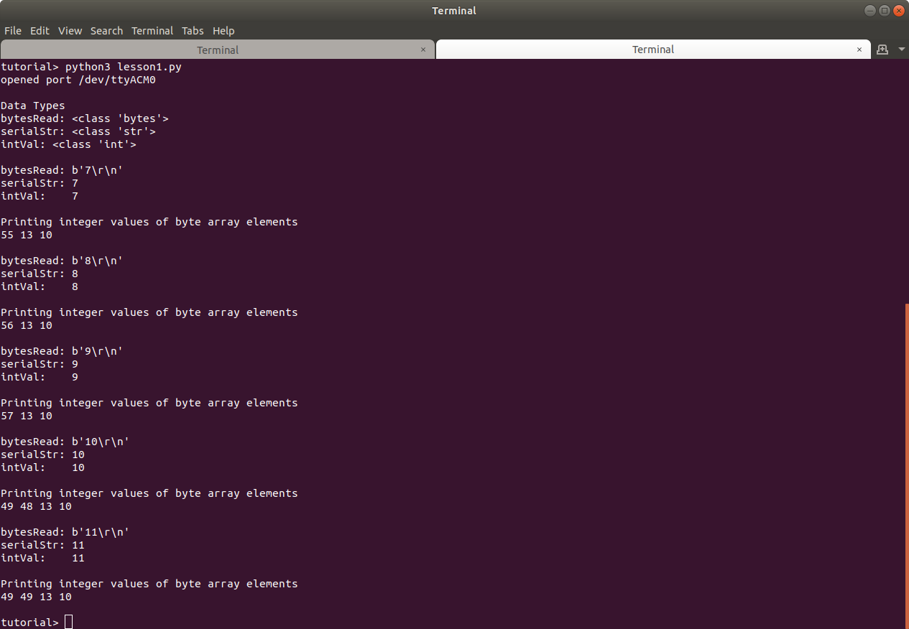

### Arduino Source Code - lesson1.ino

Description
- The program serially transmits a count value in the range [0, 255]. 
- The Serial.println function transmits numbers as ASCII characters, appending a new line character to the end.

Examples
- The value 1 is transmitted as '1' '\n'
- The value 12 is transmitted as '1' '2' '\n'
- The value 203 is transmitted as '2' '0' '3' '\n'

Instructions
- Upload the code to the Arduino. 
- Open the Arduino serial monitor to verify the program is transmitting data. 
- Close the serial monitor program. (The python program cannot connect while the serial monitor program is open.)


### python source code - lesson1.py

Description
- The program opens the serial connection to the Arduino. The path "/dev/ttyACM0" is hard-coded in the program. If your path differs, change it before running the program.
- The program loops for a count of 5
    - If serial data has been received, it reads and prints the data
- The serial connection is closed upon loop completion and the program terminates.

Instructions
- Run the program by typing `python3 lesson1.py` in a terminal command line.
- Study the program and its output. 


**pySerial readUntil function**

Note that the readUntil function is used to read all bytes received until the newline character is encountered. The function then returns all bytes read as the python type bytes.

```
''' read_until(expected=LF,size=None)

    read until an expected sequence is found('\n' by default),
    the size is exceeded or until timeout occurs. With no timeout
    it will block until the requested number of bytes is read
    '''
    bytesRead = ser.read_until()

```

**Output**

The program output is shown below. Note the variable data types and methods of conversion in the program. The bytesRead variable is an array of python bytes. The *b* indicates the type is bytes, followed by the array contents. The program illustrates how to convert the bytes to a unicode string type and an integer type.





