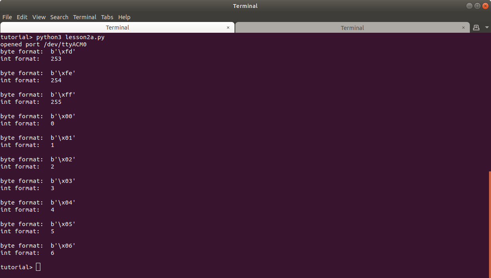

## Lesson 2 - Binary Transmission & Reception

These examples illustrate how the Arduino Serial.write function transmits data as binary values.


### Arduino Serial.write()

> The Serial.write function writes binary data to the serial port. The data is sent as a byte or a series of bytes.
>
> #### Syntax
>
> Serial.write(val)             
> Serial.write(str)
> Serial.write(buf, len)
>
> ##### Parameters
> Serial: serial port object <br>
> val: a value to send as a single byte <br>
> str: a string to send as a series of bytes <br>
> buf: and array to send as a series of bytes <br>
> len: the number of bytes to be sent from the array <br>


### Lesson 2a - Arduino transmits a single binary byte value

#### Arduino Source Code - lesson2a.ino

Description
- The program serially transmits a single value in the range [0, 255]. 
- Serial.write function transmits binary data

Examples
- The value 1   is transmitted as 00000001
- The value 9   is transmitted as 00001001
- The value 32  is transmitted as 00100000
- The value 255 is tranmsitted as 11111111

Instructions
- Upload the code to the Arduino.
- If you open the Serial monitor program, you may see no output or unexpected characters. The Serial monitor attempts to display the ASCII character representation of the binary value. Many of these values are non-printable characters.
- The Serial Monitor program must be closed before running the python program.


#### python source code - lesson2a.py

Description
- The program opens the serial connection to the Arduino. The path "/dev/ttyACM0" is hard-coded in the program. If your path differs, change it before running the program.
- The program loops for a count of 10
  - If serial data has been received
    - read a single byte
    - print the byte in its byte array form (note this is hexadecimal, not binary)
    - print the byte in its unsigned integer form

Instructions
- Run the program by typing `python3 lesson2a.py` in a terminal command line.
- Study the program and its output. 





### Lesson 2b - Arduino transmits multiple binary byte values


#### Arduino source code - lesson2b.ino

The count value data type is unsigned int, which uses 2 bytes of memory. It stores numbers in the range [0, 1023]. 

The Serial.write(buf, len) function is used to transmit both bytes. It is transmitted as a series of bytes.

Example: 
 The value 1   is transmitted as 00000000 00000001  0x00 0x01
 The value 9   is transmitted as 00000000 00001001  0x00 0x09
 The value 32  is transmitted as 00000000 00100000  0x00 0x20
 The value 256 is tranmsitted as 00000001 00000000  0x01 0x00

Note that the higher order byte is stored in the lowest array index so that it is transmitted first. Try switching the array byte order to see the effect it has when the python program reads the bytes and converts them to an integer value.

```
byte buf[2];
  // transmit higher order byte first, lower order byte second
  buf[1] = count & 0xff;            // low order byte
  buf[0] = (count >> 8) & 0xff;     // higher order byte
  Serial.write(buf, sizeof(buf));
```