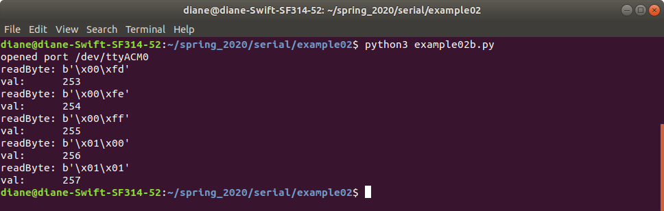

# Module 2.1 Assignment

In this assignment you will read the raw accelerometer and gyroscope values from the MPU6050. You will be use the Arduino MPU6050 library by Electronic Cats.

## Hardware Required
- Arduino Uno, Nano, or Mega
- MPU-6050 
- Jumper Wires

## Circuit Schematic

- Arduino Uno & Nano use pins A4 and A5 for I2C
   - A4 - SDA
   - A5 - SCL 

## Install Arduino MPU6050 library

From the Arduino Tools menu, choose Manage Libraries to open the Library Manager window.
Type 6050 in the Library Manager search window.
Install MPU6050 by ELectronic Cats

## Arduino Source Code

1. Write an MPU-6050 Library for Arduino.
   a. The library may consist of C-style functions or a C++ class. 
   b. An Arduino library requires at least two files:
      i.  header file  (.h)
      ii. source file (.cpp)
   c. Refer to [Writing a Library for Arduino](https://www.arduino.cc/en/Hacking/libraryTutorial)

2. Use the Arduino Wire Library for I2C communication