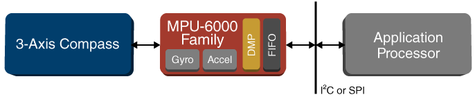

## MPU-6050 Six-Axis (Gyro + Accelerometer) MEMS MotionTracking Device

"The MPU-6050 devices combine a 3-axis gyroscope and a 3-axis accelerometer on the same silicon die, together with an onboard Digital Motion Processor™ (DMP™), which processes complex 6-axis MotionFusion algorithms. The device can access external magnetometers or other sensors through an auxiliary master I²C bus, allowing the devices to gather a full set of sensor data without intervention from the system processor" [1]

[1]: https://www.invensense.com/products/motion-tracking/6-axis/mpu-6050/

"For precision tracking of both fast and slow motions, the parts feature a user-programmable gyro full-scale range of ±250, ±500, ±1000, and ±2000 °/sec (dps), and a user-programmable accelerometer full-scale range of ±2g, ±4g, ±8g, and ±16g. Additional features include an embedded temperature sensor and an on-chip oscillator with ±1% variation over the operating temperature range." [1]

