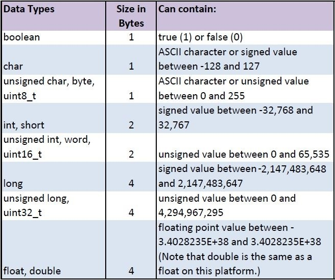
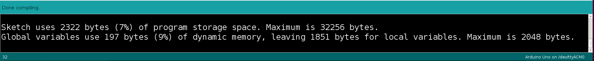

# Arduino Programming

## Where is the main function?

The Arduino IDE presents a sketch as

```
void setup() {
  // put your setup code here, to run once:

}

void loop() {
  // put your main code here, to run repeatedly:

}
```

Experienced C/C++ programmers know each program requires a main function as the starting point. Arduino hides this function from the user, adding it during the build process. The main.cpp file, shown below, is found in the /hardware/arduino/cores/arduino folder of your Arduino installation. 


### main() function

```

#include <Arduino.h>

int main(void)
{
    init();

#if defined(USBCON)
    USBDevice.attach();
#endif
   
    setup();
   
    for (;;) {
        loop();
        if (serialEventRun) serialEventRun();
    }
       
    return 0;
}
```

<br>

#### init() function

The init() function sets the register configuration of some components used by the Arduino standard library. It sets the registers of all available timers, the ADC control and status registers, and disconnects pins 0 and 1 from the USART so they can be used as normal digital I/O. (They can be reconnected with Serial.begin()). It is defined in hardware/arduino/avr/cores/arduino/wiring.c

<br>

#### #if defined(USBCON)

Some Arduino boards, such as the Leonardo, have an onboard USB device. This is needed only for those boards.

#### setup(), loop(), serialEvent

We can now see why the setup function is called only once before the loop function is called repeatedly in the infinite for loop structure. It is also easier to understand the serial event documentation that explains the serialEvent() function is only called at the end of each loop function execution, if there is receieved data available.
<br>

### Optimizing Program Memory

**Remove Unused Code**
- Unused Libraries - Are all the #include libraries actually used?
- Unused Functions - Are all the functions actually being called?
- Unused Variables - Are all the variables being used?
- Unreachable Code - Are there conditional expressions which will never be true?

If you are not sure, comment out the #include, function, or variable declaration. If the program still compiles, that code is not being used. <br> <br>

**Consolidate repeated code**

If you have the same sequence of code statements in two or more places, consider making a function for that code.<br>
<br>

### Optimizing SRAM

- Move constant data to PROGMEM, https://www.arduino.cc/reference/en/language/variables/utilities/progmem/
- Avoid dynamic memory allocation
- Reduce buffer sizes 
- Prefer local to global allocation
- Reduce oversized variables. Use only as many bytes as are needed.

<br>



[Image 1 reference][1]

[1]: https://cdn-learn.adafruit.com/assets/assets/000/031/818/medium800/learn_arduino_DataTypes.jpg?1460932589

<br>


### SRAM Management Tutorials


Improve your Arduino programming skills - SRAM Management, Joop Brokking  https://youtu.be/iOJ52VIvqYM 

Adafruit   https://learn.adafruit.com/memories-of-an-arduino/optimizing-sram


### Optimize this Arduino Sketch

<p>The following program example blinks an led and prints messages at certain time intervals.

```
const unsigned long BLINK_INTERVAL = 500;
const unsigned long PRINT_INTERVAL = 550;
unsigned long blinkTime, printTime;
byte ledState;

void setup() {
  pinMode(LED_BUILTIN, OUTPUT);
  Serial.begin(38400);
  ledState = 1;
  digitalWrite(LED_BUILTIN, ledState);
  blinkTime = millis();
  printTime = millis();
  Serial.println("setup function complete");
}

void loop() {
  if( (millis() - blinkTime) > BLINK_INTERVAL)
  {
    ledState = ledState ^ (byte)0x01;
    digitalWrite(LED_BUILTIN, ledState);
    blinkTime = millis();
  }
  else if( (millis() - printTime) > PRINT_INTERVAL)
  {
    Serial.print("Time to write a message, printTime: ");
    Serial.println(printTime);
    printTime = millis();
  }
  else
  {
    unsigned long count = millis();
    Serial.println("kill time in loop");
    while( (millis() - count) < 250); 
  }
}
```

<p>The program uses 7% of program memory space and 13% of dynamic memory when compiled for an Arduino Uno.</p>


<br>

### The F() macro

The string inside a program instruction is normally saved in RAM. If your sketch uses a lot of string constants, it can easily fill up RAM. If there is free FLASH memory space, the F macro indicates that the string must be saved in FLASH.

`Serial.println("setup function complete");`

Simply place the string inside F() as shown below.

`Serial.println(F("setup function complete"));`

<p>What is the effect of using the F() macro with the string constants in the example program above? Global variables now only use 9% of dynamic memory.</p>


<br>

