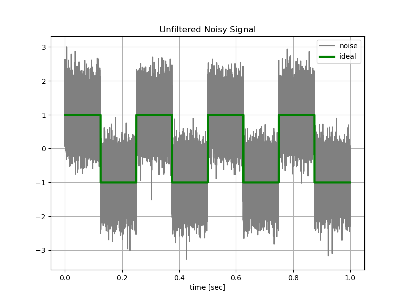
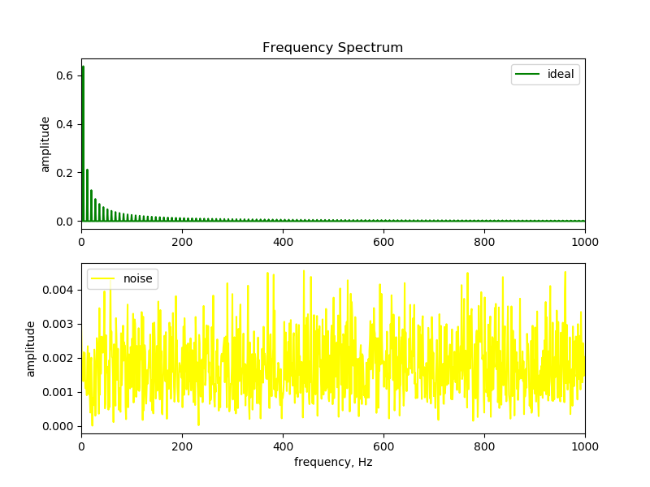
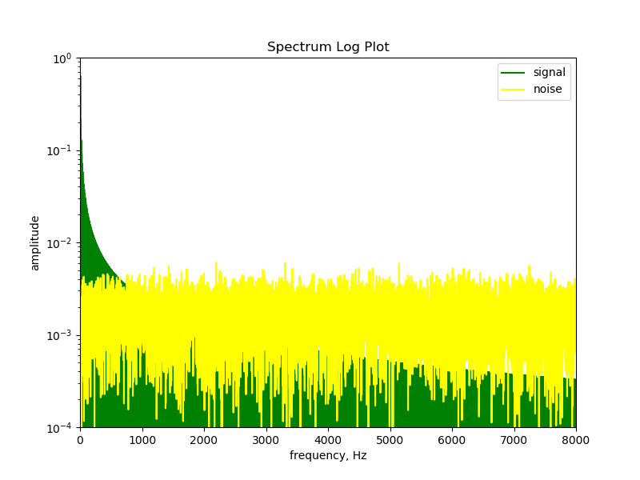
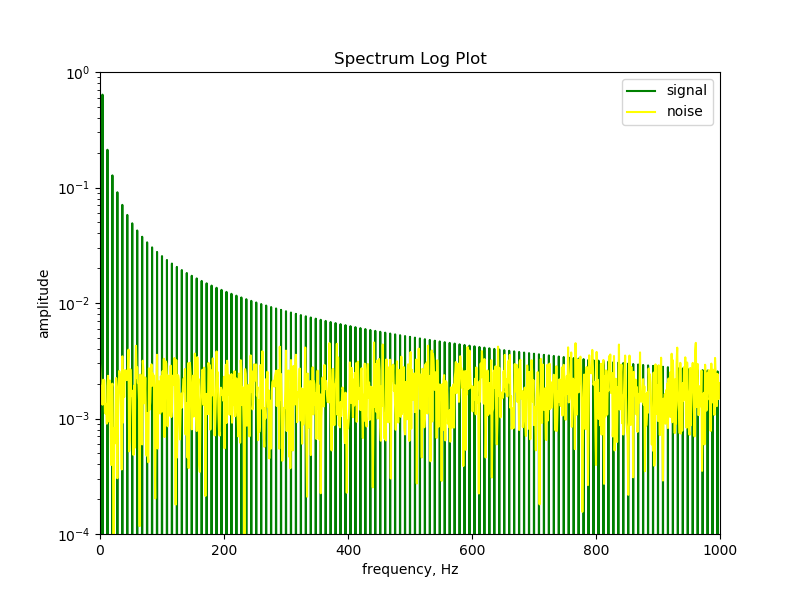
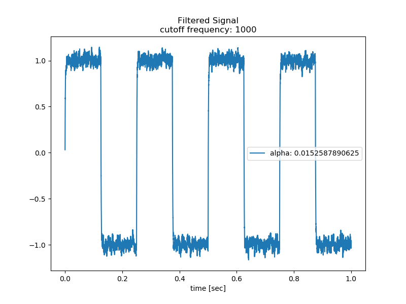
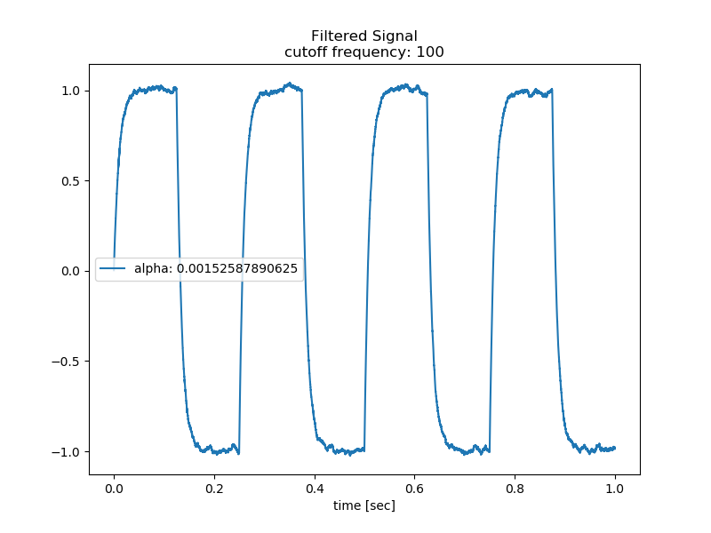

# Noisy Square Wave Example

The [source code](noisy_square_wave.py) generates the following noisy square wave signal.

 
 

The noise and signal spectrum are shown below. The signal spectrum contains much of its energy at lower frequencies, with an amplitude much greater than the noise spectrum. Square wave signal have harmonics that are odd multiples of the fundamental frequency. The square wave frequency is 4 Hz, with harmonics at 12 Hz, 20 Hz, 28 Hz, etc. The harmonic content decays as 1/f. 

The white noise spectrum is fairly evenly spread across all harmonics. The much lower noise amplitude means we can filter out the noise, using a low pass filter.
 

 
 

Plotting the spectrum on a log scale, we look for the point where the noise level is above the signal amplitude. In the plots below, it looks like the noise energy rises above and separates from the signal energy at about 1000 Hz.

 
 

 
 

Setting the cutoff frequency at 1000 Hz, and calculating &alpha; with the rough approximation: &alpha; = &Delta;t / &Tau;, the EMA filter produces the filtered signal shown below. 

>Note: The &alpha approximation is based on &alpha; = 1 - e-&Delta;t/&Tau;.
>
>The approximation is accurate for time constants where the time period is much longer than the time step, &Tau; >> &Delta;t 
>
>For fc = 1000 Hz, &Tau = 1 ms. The data was generated with &Delta;t = 15.26 microseconds 
 

 
 

Lowering the cutoff frequency to 100 Hz, produces a distorted signal, due to the phase lag. Note that &alpha; is a much smaller value, slower to respond to changes in the signal. The signal does appear to have less noise, but at a cost.

 
 

Experiment with different cutoff frequencies. How is alpha affected? How is the filtered signal changed?
