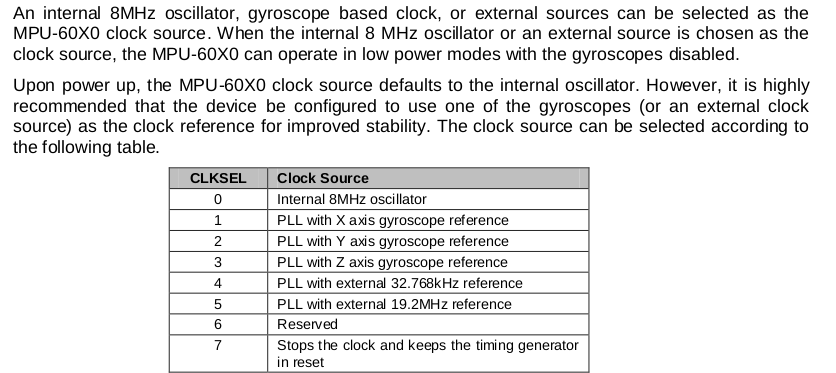
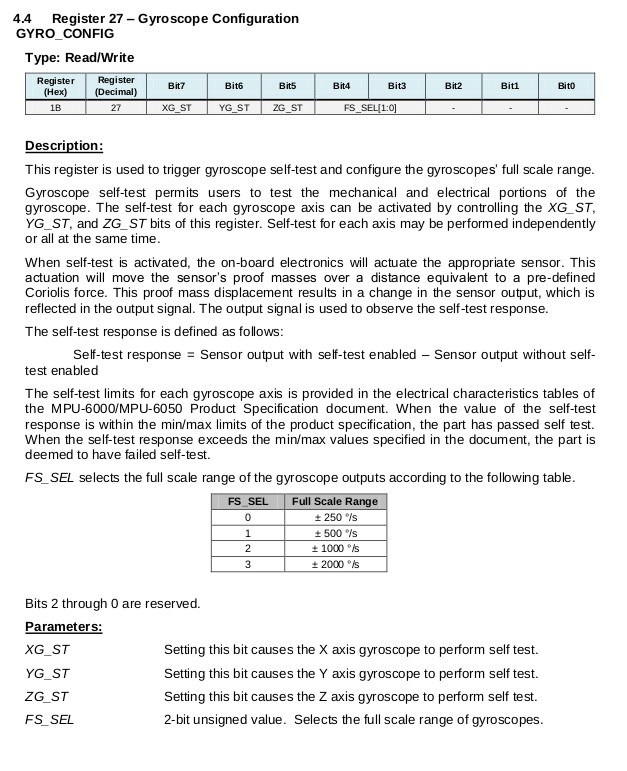
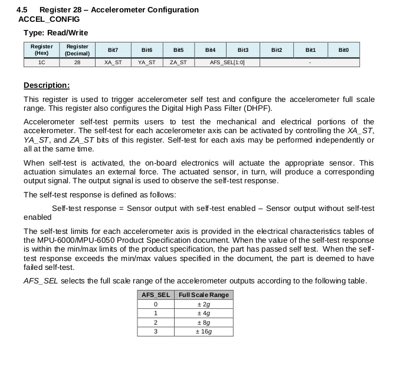
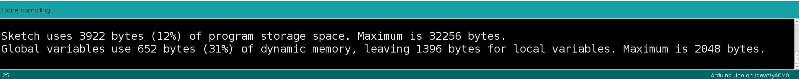

# Lesson 1 - Establishing Arduino Communication with the MPU 6050

## I2C Communication

The MPU 6050 communicates with the Arduino through the I2C (inter-integrated circuits) protocol. I2C is a synchronous, serial communication protocol, developed by Philips Semiconductors for the transfer of data between a central processor and multiple ICs on the same circuit board, using just two common wires.<br>

### Features

- Only two common bus lines (wires) are required to control any device 
- No need of prior agreement on data transfer rate like in UART communication. Data transfer speed can be adjusted whenever required.
- 7-bit addressing system to target a specific device
<br>

### Physical I2C Bus

There two interface wires are the Serial Clock Line (SCL) and the Serial Data Line (SDA). Data is transferred through the SDA wire and is synchronized with the clock signal SCL. All I2C network devices are connected to the same SCL and SDA line as shown below.
 <br><br>

<br>

[1] https://www.electronicshub.org/wp-content/uploads/2018/02/Basics-of-I2C-Communication-Masters-Slaves.jpg <br>

### Master and Slave Devices

The devices are categorized as either masters or slaves. Only one master stays active on the I2C bus at any one time. The master controls the SCL clock line and decides what operation is performed on the SDA line.

Multiple slave devices can be connected to te same I2C bus, each with a unique permanent 7-bit address. When a master wants to transfer data to or from a slave device, it specifies the slave address. Other slave devices on the same bus do not respond unless their address is specified by the master device.<br>

### I2C Speeds

The original I2C specification had a maximum speed of 100 KHz (kbits/sec). Most applications still use this speed, as it is sufficient for transferring data from sensors.

I2C has other higher speed modes, but not all devices support them.
- Fast Mode - maximum clock frequency of 400 kHz.
- Hi-Speed Mode - maximum clock frequency of 3.4 MHz
- Ultra-Fast Mode - maximum clock frequency of 5 MHz<br>

### I2C Limitations

- Not particularly fast
- Can only be used over short distances.
    - Maximum distance decreases as speed increases
    - At 100 kHz, max distance is about 1 meter<br>

### Data Transfer Protocol

Data is transferred between the master device and slave devices through a single data line, via a specific patterned bit sequence. Each bit pattern sequence is termed a transaction and structured as shown below. 

1. Master sends start condition and controls the clock signal.
2. Master sends a unique 7-bit slave device address
3. Master sends read/write bit 
    - 0 slave receive
    - 1 slave transmit
4. Slave with matching 7-bit device address always sends acknowledgement bit (ACK)
5. Transmitter (slave or master) transmits 1 byte of data
6. Receiver issues an ACK bit for the byte received
7. Repeat 5 and 6 for multiple byte transmissions
8. Master always sends stop condition
<br>
<br>

<br>

[2] https://www.electronicshub.org/wp-content/uploads/2018/02/Basics-of-I2C-Communication-Data-Transfer-Protocol.jpg 
<br>
<br>

## Arduino - MPU 6050 I2C Wiring

The Arduino Nano's I2C pins are A5 (SCL) and A4 (SDA). The MPU 6050's SCL pin is directly wired to the Arduino's SCL line. The two SDA lines are directly wired together, as shown in the image below.

The MPU 6050 board is 5V tolerant, with an on-board voltage regulator. Connect the Arduino 5V pin to the MPU 6050 5V pin. Connect the Arduino ground (GND) to the MPU 6050 ground.
<br><br>

<br>

[3] https://howtomechatronics.com/wp-content/uploads/2019/04/Arduino-and-MPU6050-Circuit-Diagram-768x400.png
<br>
<br>

## Arduino Wire Library

Arduino's Wire library makes it very easy to communicate on the I2C bus. The Arduino can be configured as a master or as a slave. The Arduino will be configured as a master when interfaced with the MPU 6050 sensor.

To use the library, it must be included in your sketch `#include <Wire.h>`
<br>
<br>

## Lesson 1 Arduino Sketch

### Objectives
- Establish I2C communication between the Arduino Nano and MPU 6050.
- Read MPU 6050 register values upon initial startup
    - Power Mangement 1
        - Is sleep mode turned on?
        - What clock is selected?
    - Configuration
        - Is external frame synchronization turned off?
        - What is the digital low pass filter configuration?
            - Acclerometer bandwidth, sample rate
            - Gyroscope bandwidth, sample rate
    - Acceleration Configuration
        - Is the self-test disabled?
        - What is the full scale range?
    - Gyroscope Configuration
        - Is the self-test disabled?
        - What is the full scale range?

### Program Files

Lesson 1 contains three source code files <br>
    - [lesson1](../lesson1/lesson1.ino)<br>
    - [mympu6050.h](../lesson1/mypu6050.h)<br>
    - [mympu6050.cpp](../lesson1/mympu6050.cpp)<br>

<p>There are Arduino libraries written for the MPU 6050. Learning to use the MPU 6050 requires studying its data sheet and register documentation to understand its capabilities whether you write your own software or use an existing library. This lesson takes the approach of writing our own source code to interface with the MPU 6050. The class MyMPU6050 is defined, with just a few member functions to achieve the above-stated objectives.</p><br>

### lesson1.ino

Let's start with the lesson1.ino source code.


1. **included files** - Wire.h is the Arduino library for I2C protocol. mympu6050.h is in the same folder as lesson1.ino and contains the macros for the MPU6050 registers and the class MyMPU6050 declaration.

```
#include <Wire.h>
#include "mympu6050.h"
```
<br>

2. **global variables** - The class object is constructed with the device's I2C address.

```
MyMPU6050 mpu(MPU6050_ADDRESS_AD0_LOW);
``` 
<p>The [datasheet](../datasheet/MPU-6000-Datasheet.pdf), section 9.2, provides the device address. The slave address of the MPU-60X0 is b110100X which is 7 bits long. The LSB bit of the 7 bit address is determined by the logic level on pin AD0. This allows two MPU-60X0s to be connected to the same I2C bus. When used in this configuration, the address of the one of the devices should be b1101000 (pin AD0 is logic low) and the address of the other should be b1101001 (pin AD0 is logic high).</p>
<p>We will connect the AD0 pin to ground to put it in a low state and use the address b1101000.</p><br> 

3. **setup function** 
<p>The operations of interest occur in the setup function as we only need to query the register states once, at startup. The infinite loop function blinks an led, thus the first line of code setting the pin mode.</p>
<p>The testConnection function is a convenient way to verify I2C communication between the Arduino and MPU6050 is working. If working, the testConnection function returns a value of 0x68.</p>
<p>After communication is verified, the reportStartState function is called. Its purpose is to call the power state, config state, accelerometer config state, and gyro config state functions.</p> 

```
void setup() {
  pinMode(LED_BUILTIN, OUTPUT);  
  
  Serial.begin(38400);
  Wire.begin();             // Initiate Wire library, join I2C bus as master
  delay(100);
  
  // test communication by reading who am i register
  uint8_t byteRead;
  byteRead = mpu.testConnection();
  if(byteRead == 0x68)
  {
    Serial.println("Success communicating with MPU 6050\n");
  }
  else
  {
    Serial.println("Error communicating with MPU 6050");
    Serial.print("who am i value: ");
    Serial.println(byteRead, HEX);
    Serial.print("using device address: ");
    Serial.println(mpu.getDeviceAddress(), HEX);
    Serial.println("enter infinite loop state");
    while(1)
    {
      delay(1000);
    }
  }

  reportStartState();

  Serial.println("setup complete");
  delay(2000);

}
```
4. **reportPowerState()**
<p>This function queries the MPU 6050 power management 1 register. Page 8, of the datasheet, indicates the reset value is 0x00 for all registers other than<br>
- Register 107: 0x40<br>
- Register 117: 0x68<br>

<p>Register 117 is the WhoAmI register that was queried by the testConnection function. Register 107 is called power management 1. Assuming that reset includes a power on/off cycle, let's see if the power management register's bit values are 0x40.</p>

The [register map](../datasheet/MPU-6000-Register-Map.pdf), section 4.28, describes the power registers. By default, the MPU 6050 starts out in sleep mode, requiring you to wake it up by setting the sleep bit to zero.
<br>


<br>


- DEVICE_RESET
    - When set to 1, this bit resets all internal registers to their default values.
    - The bit automatically clears to 0 once the reset is done.
- SLEEP 
    - When set to 1, this bit puts the MPU-60X0 into sleep mode.
- CYCLE 
    - When this bit is set to 1 and SLEEP is disabled, the MPU-60X0 will cycle between sleep mode and waking up to take a single sample of data from active sensors at a rate determined by LP_WAKE_CTRL (register 108.
- TEMP_DIS 
    - When set to 1, this bit disables the temperature sensor.
- CLKSEL 3-bit unsigned value. Specifies the clock source of the device.
    - Clock source settings shown below
<br>
<br>

<br><br>


5. **reportConfigState()**

The [register map](../datasheet/MPU-6000-Register-Map.pdf), section 4.3, describes the configuration register. It configures the external Frame Synchronization (FSYNC) pin sample and the Digital Low Pass Filter (DLPF) setting for both the gyroscopes and accelerometers. It is expected that the EXT_SYNC_SET bits will be zero for external frame synchronization and the DLPF bits will be zero as well.
<br>


<br>

6. **reportGyroConfigState()**

The [register map](../datasheet/MPU-6000-Register-Map.pdf), section 4.4, describes the gyroscope configuration register. It configures the gyroscope self-test bits and the full scale range. It is expected that all register bits will be zero, turning off the self-test and selecting the full-scale range as 250&deg;/s.
<br>

<br>

7.  **reportAccelConfigState()**

The [register map](../datasheet/MPU-6000-Register-Map.pdf), section 4.5, describes the gyroscope configuration register. It configures the accelerometer self-test bits and the full scale range. It is expected that all register bits will be zero, turning off the self-test and selecting the full-scale range as +-2g.
<br>

<br>

8. **run the program**

Is the program output as expected? Study the output as it relates to the register settings. <br>

### Reducing Global Variables Dynamic Memory Usage

Note that 73% of dynamic memory is used by global variables. Based on the discussion in Arduino Nano [optimizing arduino code memory](../../arduino_nano/optimizing_arduino_code_memory.md) lesson, what should be done to reduce the amount of memory the constant strings require?<br>


<br>