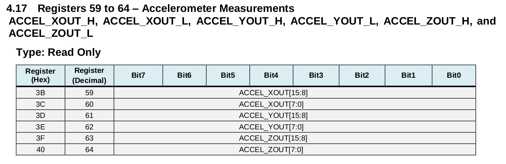
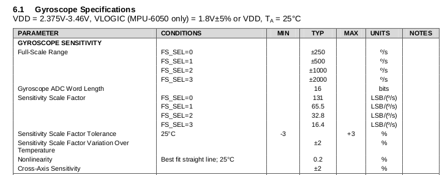
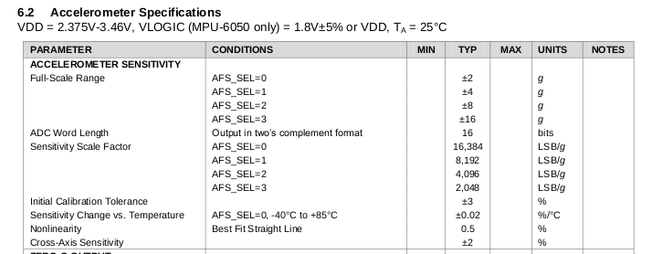
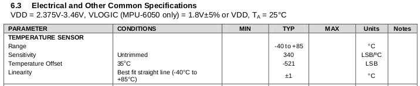

# Lesson 3 - Read raw data

## Sensor Data Structure

The sensor data values are 16 bit signed. There are seven data fields, as described by the variables in the struct below.

```
struct sensorData
{
  int16_t accelX;
  int16_t accelY;
  int16_t accelZ;
  int16_t temperature;
  int16_t gyroX;
  int16_t gyroY;
  int16_t gyroZ;
};
```
<br>
<br>

## Reading Raw Data Values

<p>The MyMPU6050 class function readAllData reads the accelerometer, gyroscope and temperature measurements registers. Registers 59 to 64 (0x3B to 0x40) contain the accelerometer x data. Registers 65 and 66 contain the temperature data bits. Registers 67 to 72 contain the gyroscope measurements.</p>

<br><br>


```
uint8_t MyMPU6050::readAllData(struct SensorData* sd)
{
  uint8_t buf[14];
  int bytesRead;
  bytesRead = readBytes(MPU6050_RA_ACCEL_XOUT_H, buf, (uint8_t)14);
  if(bytesRead == 14)
  {
    // first byte read from high order register, second byte from low
    // form 16 bit value from 8 bit values
    sd->accelX = (((int16_t)buf[0]) << 8) | buf[1];
    sd->accelY = (((int16_t)buf[2]) << 8) | buf[3];
    sd->accelZ = (((int16_t)buf[4]) << 8) | buf[5];
    sd->temperature = (((int16_t)buf[6]) << 8) | buf[7];
    sd->gyroX = (((int16_t)buf[8]) << 8) | buf[9];
    sd->gyroY = (((int16_t)buf[10]) << 8) | buf[11];
    sd->gyroZ = (((int16_t)buf[12]) << 8) | buf[13];
  }

  return bytesRead;

}
```


## Sensitivity Scale Factor

<p>The raw data values must be scaled by the sensitivity scale factor. Datasheet sections 6.1 and 6.2 of list the scaling factors. The accelerometer data must be scaled by 16384 LSB/g because AFS_SEL was configured as +-2 g/s. The gyroscope data must be scale by 131 LSB/(&deg;/s) because FS_SEL was set to +- 250 &deg;/s.</p>

<u>Calculations</u>

(accelerometer raw measurement, LSB) / (16384 LSB/g) = acceleration, g<br>

(gyroscope raw measurement, LSB) / (131 LSB/(&deg;/s)) = gryoscope, &deg;/s<br>
<br>

<br><br>

<br><br>

<p>The raw temperature data must be scaled as well. The temperature range is -40 &deg;C to +85 &deg;C, section 6.3. A raw value of -512 is 35 &deg;C. From the 35 &deg;C point, every 1 &deg;C change is represented by a raw value change of 340 LSB/&deg;C.</p>
<p>The zero temperature point is calculated as -512 LSB + (-35 &deg;C - 0 &deg;C) * 340 LSB/&deg;C = -12412 LSB.</p>
<p>Conversion of raw temperature to degrees C: (raw measurement in LSB - 12412 LSB) / (340 LSB/&deg;C) = temperature in &deg;C</p>


<br><br>


```
void printScaledData(const SensorData *sd)
{
  Serial.print("a/g:\t");
  Serial.print(sd->accelX / 16384.0f); Serial.print("\t");
  Serial.print(sd->accelY / 16384.0f); Serial.print("\t");
  Serial.print(sd->accelY / 16384.0f); Serial.print("\t");
  Serial.print(sd->gyroX / 131.0f); Serial.print("\t");
  Serial.print(sd->gyroY / 131.0f); Serial.print("\t");
  Serial.println(sd->gyroZ / 131.0f); 
}
```