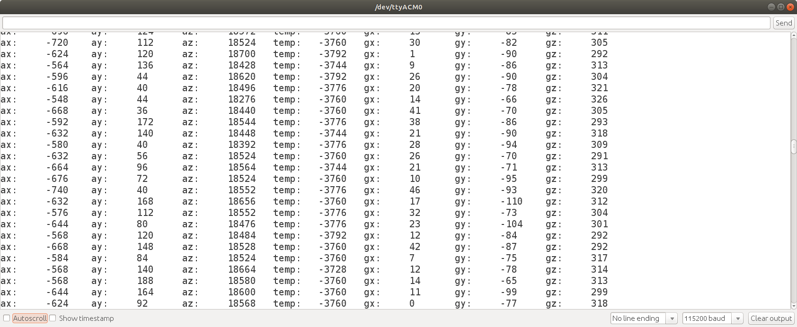
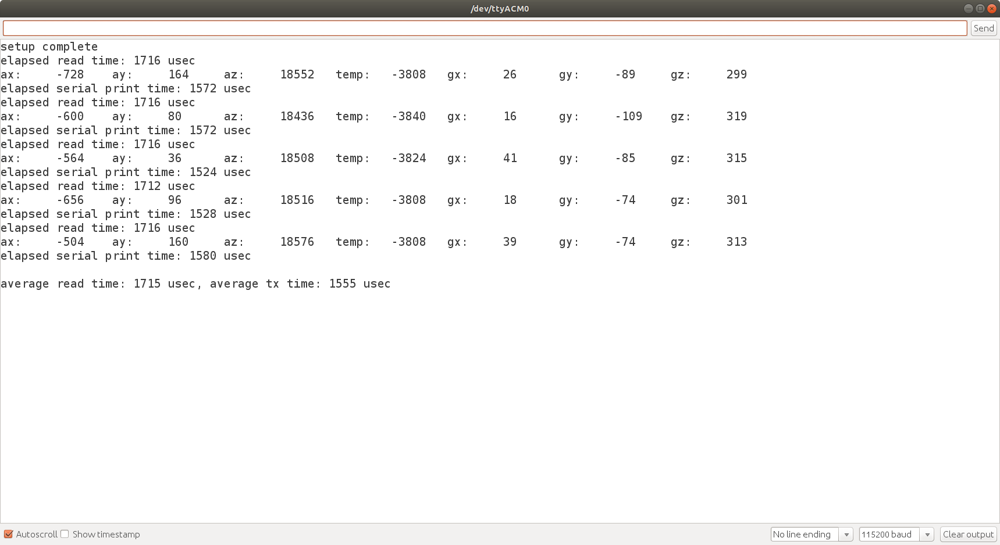
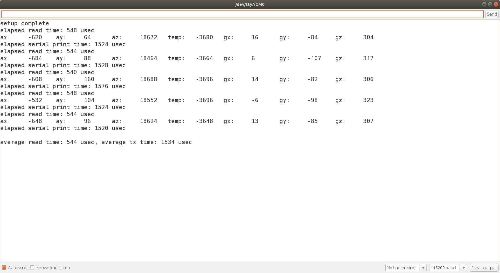
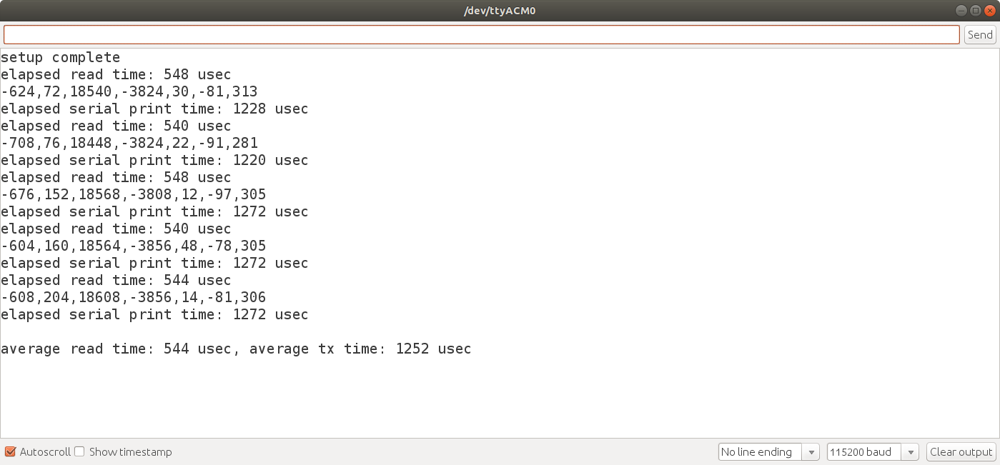
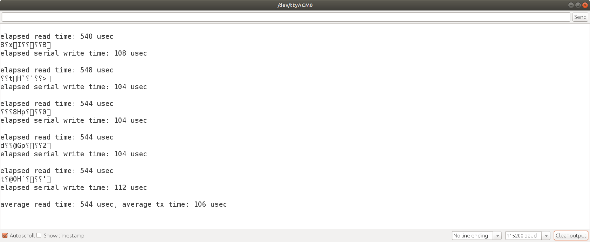

# Lesson 8 - How fast can we sample the measurement data?

The default setting of the DPLF_CFG bit field in the CONFIG configuration register 26 is 0. Section 4.3 of the register map pdf, shows the accelerometer sampling frequency, F<sub>s</sub> = 1 kHZ and gyroscope sampling frequency,  F<sub>s</sub> = 8 kHZ. This is the limit imposed by the sensor hardware, but what about I2C communication speed limitations? 

**What is our practical limit for reading the accelerometer, temperature, and gyroscope data, using I2C communication?**

We have been using the Arduino Wire libary, standard mode, clock frequency, 100 kHz. How much data can we theoretically read at that clock frequency? 
 
I2C serial communication transmits one bit each clock cycle. There are 8 bits per each data byte, plus one ack bit that must follow each byte. This requires a total of 9 clock cycles.

Initiating data transfer requires the master to generate the start condition, send the 7-bit slave address, the read/write data direction bit, and an ack bit as the 9th bit.  In our case, the master is sending a read data direction bit and can then begin reading after the ack bit. After the data bytes are read the master transmits a stop condition.


https://www.circuitbasics.com/wp-content/uploads/2016/01/Introduction-to-I2C-Message-Frame-and-Bit-2.png 


Our example Arduino code, shown below, sends the MPU6050 I2C address, register number and then reads 14 data measurement registers. 

```
Wire.beginTransmission(MPU6050_ADDRESS_AD0_LOW);
Wire.write(0x3B);                     // start reading register 0x3B (ACCEL_XOUT_H)
Wire.endTransmission(false);
Wire.requestFrom(MPU6050_ADDRESS_AD0_LOW, 14);  // request reading 14 bytes
ax = Wire.read() << 8 | Wire.read();    // reads 0X3B (ACCEL_XOUT_H) and 0x3C (ACCEL_XOUT_L)
ay = Wire.read() << 8 | Wire.read(); 
az = Wire.read() << 8 | Wire.read(); 
temp = Wire.read() << 8 | Wire.read(); 
gx = Wire.read() << 8 | Wire.read(); 
gy = Wire.read() << 8 | Wire.read(); 
gz = Wire.read() << 8 | Wire.read(); 
```

The table below contains the number of clock cycles required for the data transferred.

| Data | Clock Cycles |
| --- | --- |
| i2c address | 7 |
| read/write bit | 1 |
| ack bit | 1 |
| register number | 9 |
| accel x | 18 |
| accel y | 18 |
| accel z | 18 |
| temperature | 18 |
| gyro x | 18 |
| gyro y | 18 |
| gyro z | 18 |

Total clock cyles = (7 + 1 + 1) + 1 x 9 + 7 * 18 = 144 clock cycles

<br>
At 100 kHZ, 144 clock cycles require 1.44 ms. There will be additional overhead time due to the Arduino programming code function calls. A 1.44 ms time period corresponds to a frequency of approximately 694 Hz, slower than the possible 1 kHz sample rate.

The MPU 6050 also supports an i2c fast mode clock frequency of 400 kHZ. At 400 kHz, 144 clock cycles require 0.36 ms, a frequency of 2778 Hz. 

Let's examine how program design choices affect program execution speed:
- I2C clock frequency
- Serial baud rate
- Serial print versus write functions

<br>

## lesson8a.ino

The Arduino lesson8a sketch reads data from the sensor and serially transmits the values read at a rate of 1 kHz. Reading the data registers at the max rate of 1000 samples/second has a sampling time interval of 1 millisecond (1000 micro seconds). The macro '`#define SAMPLE_INTERVAL_USEC 1000` is used to control read timing. 

Running the program produces output similar to that shown below.




<br>
The output looks fine, but <b>how do we know if the data is being read 1000 times per second?</b> How long does it take to read the data from the sensor's registers, store it in memory, and serially transmit it? 


## lesson8b.ino - Timing program control flow

The lesson8b Arduino sketch measures the elapsed time required to read the measurement data from the MPU6050 registers. It repeats this 5 times and calculates the average read time. Additionally, it measures the average elapsed time required to serially transmit the data. The image below shows the Serial monitor output for one test run.

The average read time is 1.715 ms, for standard mode clock frequency. At a baud rate of 115200, the average time to serially transmit the data through the USB connection to the serial monitor was 1.555 ms. The Serial.print functions were used for transmission.



Clearly, the program is not able to read and transmit the data at 1 kHz, requiring 3.27 ms to read and transmit in the test run. The above results are based on one test run that averaged the timing of 5 read/transmits. Changing the count to 100 and running the experiment several times produced similar timing results. Don't take my word for it, try it for yourself.

Now that we are convinced the timing data is consistent for multiple samples, what can we do to improve the execution time?

The factors that affect execution time are

- I2C clock frequency
- Serial print versus write
- Serial baud rate

Let's start with te I2C clock frequency. Section 5.3 of the sensor's data sheet indicates 400 kHz Fast Mode I2C is supported for communicating with all registers. Let's test the effect of increasing the I2C clock frequency from 100 kHz to 400 kHz.


### Fastmode clock frequency

The Arduino Wire library standard mode clock frequency is 100 kHz. The setClock function is used to set it to fast mode, 400 kHz, immediately after the Wire.begin function.

```
Wire.begin();
Wire.setClock(400000L);
```
<br>
<br>

The image below shows the fast mode clock frequency had an average read time of 0.544 ms, 1.165 ms faster than standard mode, which is about 3 times faster. This is fast enough to achieve the MPU 6050 hardware sampling rate of 1 kHz for read time, but we still need to speed the serial transmission time.



The Serial print is transmitting extra information, such as the labels "ax: ", etc. 

```
Serial.print("ax: \t");   Serial.print(ax);
Serial.print("\tay: \t"); Serial.print(ay);
Serial.print("\taz: \t"); Serial.print(az);
Serial.print("\ttemp: \t"); Serial.print(temp);
Serial.print("\tgx: \t");   Serial.print(gx);
Serial.print("\tgy: \t"); Serial.print(gy);
Serial.print("\tgz: \t"); Serial.println(gz);
``` 

Let's remove the unneccessary labels and tabs, just transmitting the values, separated by commas. The commas (or some other delimiter) are needed so that the receiving program is able to separate the values.

```
Serial.print(ax);
Serial.print(",");
Serial.print(ay);
Serial.print(",");
Serial.print(az);
Serial.print(",");
Serial.print(temp);
Serial.print(",");
Serial.print(gx);
Serial.print(",");
Serial.print(gy);
Serial.print(",");
Serial.print(gz);
```


This improves the serial print time to 1.252 ms, but not enough to meet the overall 1 kHz requirement for both reading and transmission.



<br>
<br>

### What is the correct baud rate?

Is it the baud rate that is slowing transmission? What is the worst case number of bytes transitted with the above code?

The int16_t values can range from -32768 to 32767. -32768 requires 6 characters at 1 character per byte, or 6 bytes. Each comma requires 1 byte. The println sends a carriage return and line feed.

<b><u>Serial print Byte Calculations</u></b>

(7 data measurements x 6 bytes) + (6 commas x 1 byte) + carriage return byte + new line byte = 50 bytes.

50 bytes x 10 bits/ byte = 500 bits.

1000 transmissions/sec x 500 bits/transmission = 500,000 bits / second.

The 115,200 baud rate only allows 115,200 bits /second. That's a bottleneck as well. We can increase the baud rate and/or more efficiently transmit data with the Serial write function.
<br>

<b><u>Serial write Byte Calculations</u></b>

The Serial write function transmits the int16_t values as a series of two bytes. This is better than the worst case ASCII character transmission of 6 bytes. We do not need the comma delimiter because we know exactly how many bytes will be transmitted each time.

7 data measurements/transmission x 2 bytes/measurement = 14 bytes / transmission

14 bytes/transmission * 10 bits/byte = 140 bits/transmission

140 bits/transmission * 1000 transmissions/sec = 140,000 bits/sec

This still exceeds the 115200 baud rate. Lesson8c uses the Serial.write function to measure the transmission timing.


## lesson8c.ino - Serial.write time

Lesson 8c uses the Serial write function to transmit the measurements. The example output below shows the improved transmission time of 0.106 ms for each transmission. The baud rate was 115200. With a read time of 0.544 ms and transmission time of 0.106 ms, this code achieves the program execution time of less than 1 ms for reading and transmitting the data. 

Note that what appears to be garbage characters in the output image is the ASCII representation of the data measurements. The Serial monitor program tries to convert the byte values to printable ASCII characters.



It is left as a student exercise to test how changing the baud rate affects execution time. Remember to consider the microcontroller's error at various baud rates.


## Conclusion

This lesson demonstrated the importance of considering how communication settings such as clock frequency and baud rate affect program execution time. Also, the difference in Serial print and write functions plays a crucial role in execution time. 

When working with time sensitive data, we must always check program execution time to verify the code runs at the expected rate. 
