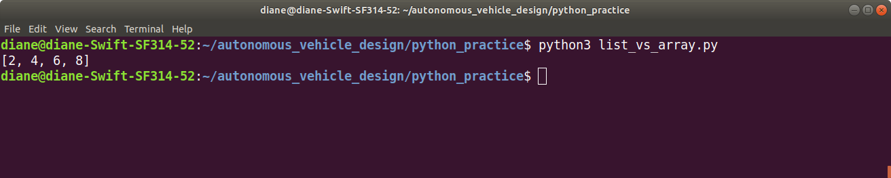

# NumPy

NumPy is the fundamental package for scientific computing with Python. It contains among other things:
- a powerful N-dimensional array object
- sophisticated (broadcasting) functions
- tools for integrating C/C++ and Fortran code
- useful linear algebra, Fourier transform, and random number capabilities

https://numpy.org/

**NumPy Quickstart Tutorial** https://numpy.org/devdocs/user/quickstart.html 


### Differences between Python Lists and NumPy Arrays

<p>The values stored in a NumPy array must all be the same data type. The data types stored in a python list can all be different. Mathematical operators behave differently when applied to a list and to a NumPy array.

The source code below demonstrates the different behavior of using the multiplication operator with a list and an array.</p><br>

```
import numpy as np 

# create a list
aList = [1, 2, 3, 4]

print("-- List versus array, scalar multiplication --")
print("aList    ", end='')
print(aList)
# multiplication of a list extends and repeats the list
print("aList*2  ", end='')
print(aList*2)


# create an array
aArray = np.arange(4)
print("aArray   ", end='')
print(aArray)
# each element in array is multiplied by the scalar value
print("aArray*2 ", end = '')
print(aArray*2)
```


<p>The program output below demonstrates that using the muliplication operator with a list repeats and extends the list. Using the multiplication operator with an array, multiplies each array element by the scalar.</p><br><br>


<br>
<br>
<br>
<p>A loop must be used to multiply each element in a python list by a scalar. The source code below provides an example. </p><br><br>

```
# create a list
aList = [1, 2, 3, 4]
for i, item in enumerate(aList):
    aList[i] == aList[i]*2
print(aList)
```
<br><br>
<p>The program output illustrates that each element of the list was multiplied by the scalar value.</p><br>


<br>
<br>
<br>

<p>Performing this looping operation on a list is computationally expensive. We define <i>computationally expensive</i> as an operation that takes a lot of processing time or storage resources such as RAM and CPU bandwidth.</p><br><br>

<p>The following example times these operations for a list and array of the same size. Iterating through the list takes significantly longer than the array multiplication. </p><br><br>


```
import time

n = 10000
aList = list(range(n))

# returns seconds as a float
start = time.time()
for i, item in enumerate(aList): 
    aList[i] = aList[i]*2
stop = time.time()

elapsed = stop - start 
print("list time:  " + str(elapsed*1000) + " msec")

aArray = np.arange(n)
start = time.time()
aArray = aArray * 2
stop = time.time()
elapsed = stop - start
print("array time: " + str(elapsed*1000) + " msec")
```
<br>
<br>
<p>Timing Output: The list loop iteration takes approximately 57 times longer to execute than the array operation.</p><br>


<br>
<br>
